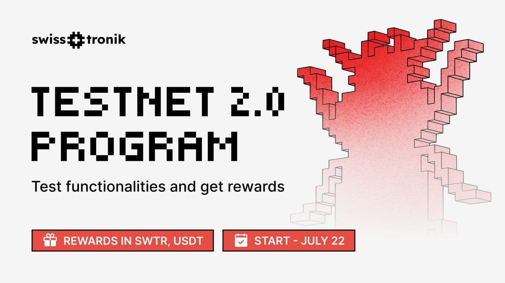

# Swisstronik Incentivized Testnet 2.0 Guide

## Project Info

- Twitter: https://x.com/swisstronik
- Discord: https://discord.com/invite/swisstronik
- Testnet: https://www.swisstronik.com/testnet2/dashboard

# First Task Guide

- Use New EVM Wallet
- First Claim faucet: https://faucet.testnet.swisstronik.com
- Here is the link of guide of first task : [Click Here](https://github.com/BidyutRoy2/Swisstronik-Testnet/blob/main/DEPLOY-SIMPLE-CONTRACT.md)

  

# Second Task Guide
- Do these tasks [Here](https://github.com/BidyutRoy2/Swisstronik-Testnet/blob/main/MINT-100-ERC-20-TOKENS.md)
- Now visit [this site](https://github.com/BidyutRoy2/Swisstronik-Testnet/blob/main/Upload-To-Github.md) to upload codes on ur github
- Afterthat, Visit [Swisstronik Testnet Website](https://www.swisstronik.com/testnet2/dashboard) to submit your newly created contract address, Transfer Tx URL and repo link

# New Simple Contract Deployment Script [Link Here](https://github.com/BidyutRoy2/Swisstronic-Script)

  

# ▄︻デ𝙂𝙚𝙩 𝙇𝙖𝙩𝙚𝙨𝙩 𝘼𝙞𝙧𝙙𝙧𝙤𝙥𝙨 & 𝙐𝙥𝙙𝙖𝙩𝙚𝙨═━一

### ▄︻デ𝙅𝙤𝙞𝙣 𝙏𝙚𝙡𝙚𝙜𝙧𝙖𝙢═━一 [🎀  𝐻𝒾𝒹𝒹𝑒𝓃 𝒢𝑒𝓂  🎀](https://t.me/hiddengemnews) 

### ░▒▓█►─═  𝓗𝓲𝒹ᗪ𝓔η Ǥέ𝕄 ═─◄█▓▒░
